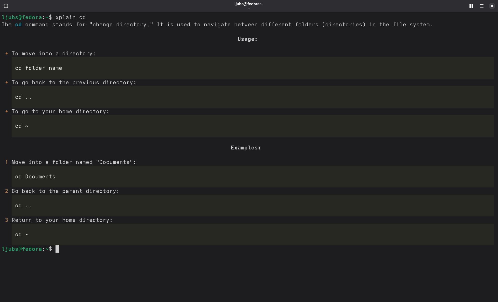

# xplain
A modern take on Unix man pages, powered by an LLM.

`xplain` is a terminal tool that explains Unix commands in plain English, with examples. It’s beginner-friendly, snappy, and optionally funny.

## Installation

``bash
git clone https://github.com/yourusername/xplain.git
cd xplain
pip install .

## Setup
You’ll need an OpenAI API key:
export OPENAI_API_KEY=sk-...your_key...
